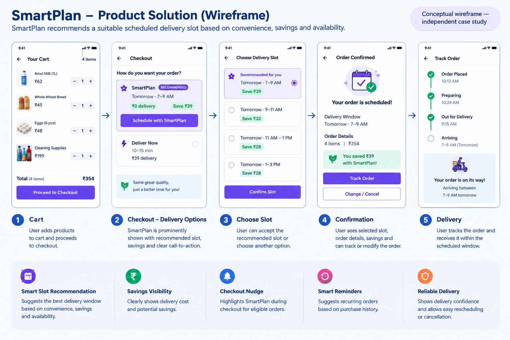
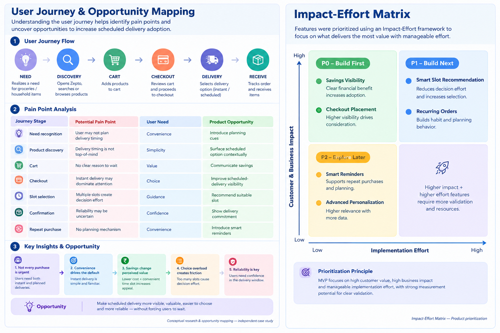

# Zepto Scheduled Delivery Optimization

## Product Management Self Project

A product management case study exploring how Zepto could increase adoption of scheduled deliveries while maintaining customer convenience and delivery reliability.

---

##  Project Overview

### Problem

Quick-commerce platforms are optimized around instant delivery, but many grocery purchases are non-urgent. Users may still default to instant delivery because it is more visible, familiar and convenient.

This creates an opportunity to make scheduled delivery more valuable and easier to adopt for suitable orders.

### Product Opportunity

**How might Zepto encourage users to shift suitable non-urgent purchases from instant to scheduled delivery without compromising convenience or reliability?**

---

##  Objective

Increase scheduled-order adoption while improving delivery efficiency and maintaining a reliable customer experience.

### Target Outcomes

* Increase scheduled-order share
* Reduce delivery cost per order
* Improve delivery capacity utilization
* Maintain scheduled-delivery reliability
* Reduce decision effort during checkout

---

# 1. User Research & Discovery

## Target Users

| Attribute         | Description                      |
| ----------------- | -------------------------------- |
| User segment      | Frequent quick-commerce users    |
| Purchase behavior | Grocery and household purchases  |
| Primary need      | Convenience and reliability      |
| Current behavior  | Preference for instant delivery  |
| Opportunity       | Non-urgent and planned purchases |

## Research Approach

The project uses a hypothesis-driven product research approach combining:

* Secondary research
* User journey analysis
* Competitor experience analysis
* Pain-point identification
* Product opportunity assessment

> **Note:** This is an independent case study. Research findings and metrics are product hypotheses/targets, not proprietary Zepto data.

---

## User Journey

```text
Need arises
     ↓
Open Zepto
     ↓
Search products
     ↓
Add to cart
     ↓
Checkout
     ↓
Delivery selection
     ↓
Instant / Scheduled
     ↓
Order confirmation
```

---

## Key Pain Points

| Journey Stage     | Pain Point                              | Opportunity                  |
| ----------------- | --------------------------------------- | ---------------------------- |
| Product discovery | Delivery timing is not considered early | Introduce planning cues      |
| Cart              | Value of scheduling is unclear          | Communicate savings          |
| Checkout          | Instant delivery is the default choice  | Improve scheduled visibility |
| Slot selection    | Users may not know the best slot        | Recommend optimal slots      |
| Confirmation      | Reliability may be uncertain            | Show delivery confidence     |
| Repeat purchase   | No planning mechanism                   | Introduce smart reminders    |

---

# 2. Key Insights

### Insight 1 — Not every purchase is urgent

Users may need instant delivery for urgent requirements but can plan purchases such as household supplies, packaged food and recurring groceries.

### Insight 2 — Instant delivery can become the default

When instant delivery is the most prominent option, users may not actively evaluate whether they actually need it.

### Insight 3 — Scheduled delivery needs a clear value proposition

Users need a simple reason to wait, such as:

**Lower delivery cost + convenient time slot + reliable delivery**

### Insight 4 — Recommendations can reduce decision effort

Instead of asking users to manually compare multiple delivery slots, Zepto can recommend a suitable option.

---

# 3. Solution — SmartPlan

## Product Concept

**SmartPlan** is a personalized scheduled-delivery experience that recommends the most suitable delivery slot based on convenience, savings and availability.

### Core Features

#### 1. Smart Slot Recommendation

Recommend a suitable delivery window instead of making users manually evaluate every available slot.

**Example:**

> 📅 Recommended
> Tomorrow · 7–9 AM
> ₹0 delivery
> **Save ₹39**

---

#### 2. Savings Visibility

Clearly communicate the financial benefit of choosing scheduled delivery.

| Option               | Delivery |
| -------------------- | -------: |
| Deliver Now          |      ₹39 |
| SmartPlan            |       ₹0 |
| **Potential saving** |  **₹39** |

---

#### 3. Smart Checkout Nudge

For suitable non-urgent orders:

> **You can save ₹39 by scheduling this order for tomorrow.**

The user can still choose instant delivery.

---

#### 4. Smart Reminders

For recurring purchases:

> **You usually purchase these items every Monday. Schedule your next order?**

This aims to turn scheduled delivery into a repeat behavior.

---

# 4. Feature Prioritization

Features were prioritized using an **Impact-Effort framework**.

| Feature                   | Impact | Effort | Priority |
| ------------------------- | ------ | ------ | -------- |
| Smart slot recommendation | High   | Medium | P0       |
| Savings visibility        | High   | Low    | P0       |
| Checkout placement        | High   | Low    | P0       |
| Smart reminders           | Medium | Medium | P1       |
| Recurring orders          | High   | High   | P1       |
| Advanced personalization  | Medium | High   | P2       |

### MVP

The initial MVP focuses on:

1. Smart slot recommendations
2. Savings visibility
3. Checkout nudges
4. Basic product analytics

---

# 5. Experimentation

## A/B Test 1 — Smart Slot Recommendation

### Hypothesis

Showing a recommended delivery slot will increase scheduled-delivery selection.

**Control**

> Choose a delivery slot

**Variant**

> Recommended: Tomorrow · 7–9 AM
> Save ₹39

**Primary Metric**

Scheduled-delivery conversion rate

**Secondary Metrics**

* Checkout conversion
* Cancellation rate
* Delivery cost per order

---

## A/B Test 2 — Savings Messaging

### Hypothesis

Explicitly communicating savings will increase scheduled-delivery adoption.

**Control**

> Scheduled Delivery

**Variant**

> Save ₹39 with Scheduled Delivery

**Primary Metric**

Scheduled-order share

---

## A/B Test 3 — Checkout Placement

### Hypothesis

Increasing visibility of SmartPlan at checkout will improve scheduled-slot selection.

**Control**

Scheduled delivery displayed below instant delivery.

**Variant**

SmartPlan recommendation displayed prominently during delivery selection.

**Primary Metric**

Scheduled-delivery selection rate

---

# 6. Success Metrics

## North-Star Metric

### Scheduled Order Share

Percentage of eligible orders completed using scheduled delivery.

## Supporting Metrics

| Metric                    |                  Target |
| ------------------------- | ----------------------: |
| Scheduled-order share     |                6% → 15% |
| Delivery cost / order     |                    -15% |
| Scheduled delivery SLA    |                    ≥97% |
| Scheduled-slot conversion |                    +20% |
| Cancellation rate         | No significant increase |

> These are proposed project targets, not actual Zepto performance results.

---

# 7. Product Roadmap

### Phase 1 — MVP

**Weeks 1–2**

* Smart slot recommendation
* Savings messaging
* Checkout placement
* Basic event tracking

### Phase 2 — Optimization

**Weeks 3–5**

* Personalized recommendations
* Smart reminders
* Dynamic incentives
* A/B testing

### Phase 3 — Scale

**Weeks 6–8**

* Capacity-aware scheduling
* Predictive demand signals
* Advanced personalization
* Recurring purchase recommendations

---

# 8. Product Analytics

### Key Events

```text
delivery_option_viewed
scheduled_slot_viewed
smartplan_recommendation_shown
smartplan_selected
instant_delivery_selected
scheduled_order_confirmed
scheduled_order_cancelled
order_delivered
```

### Funnel

```text
Checkout Users
      ↓
Delivery Options Viewed
      ↓
SmartPlan Viewed
      ↓
Scheduled Slot Selected
      ↓
Scheduled Order Confirmed
      ↓
Order Successfully Delivered
```

This funnel can help identify where users drop off during scheduled-delivery adoption.

---

# 9. PRD

The detailed product requirements are documented separately in:

**[PRD.md](PRD.md)**

---

# 10. Experimentation Framework

Detailed A/B testing hypotheses, control/variant definitions and measurement plans are documented in:

**[EXPERIMENTATION.md](EXPERIMENTATION.md)**

---

# 11. Project Artifacts

| Artifact         | Purpose                                            |
| ---------------- | -------------------------------------------------- |
| User Research    | Research approach, journey mapping and pain points |
| Problem Analysis | Opportunity sizing and prioritization              |
| SmartPlan        | Product solution and feature design                |
| Experimentation  | A/B testing and validation strategy                |
| PRD              | Product requirements and implementation roadmap    |

---

## Skills Demonstrated

* User Research
* User Journey Mapping
* Pain-Point Analysis
* Problem Prioritization
* Product Strategy
* Feature Prioritization
* Impact-Effort Analysis
* A/B Testing
* Product Analytics
* PRD Development
* Product Roadmapping
* KPI Definition

---
## Product Visuals

### Product Solution — SmartPlan



### User Journey & Prioritization


## Disclaimer

This is an independent Product Management case study created for learning and portfolio purposes. It uses publicly available information, product assumptions and proposed targets. It is not affiliated with or endorsed by Zepto, and the metrics presented are not actual Zepto performance data.
